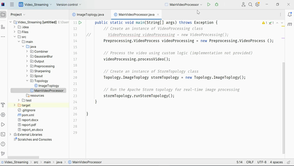

# Video-Stream-Processing-with-Apache-Storm

Designing and implement a real-time image processing application using Apache Storm

## Table of contents

**[Objective](#objective)**

**[Framework and Tools](#framework-and-tools)**

**[Expected Outcome](#expected-outcome)**

**[Main Concepts in Apache Storm](#main-concepts-in-apache-storm)**

**[System Mode](#system-mode)**

**[Details of Files](#details-of-files)**

**[Conclusion](#conclusion)**

## video

## Objective

The primary goal of this project is to design and implement a real-time image processing application using Apache Storm. The application aims to showcase distributed computing principles by processing video frames in parallel, applying various image filters, and aggregating the results. The project emphasizes the utilization of Apache Storm, a powerful and scalable distributed stream processing framework, to achieve efficient and real-time image processing.

**Key Features and Objectives:**

2.  **Real-time Stream Processing:** Implement a streaming data processing pipeline that operates in real-time, demonstrating the capabilities of Apache Storm for handling continuous streams of data.

3.  **Parallel Image Processing:** Utilize distributed computing principles to process video frames in parallel. This involves breaking down the image processing tasks into smaller, independent units that can be executed concurrently on multiple nodes.

4.  **Image Filtering:** Apply image filters to enhance or modify the visual characteristics of each frame. Image processing libraries, such as OpenCV for Java, will be employed to implement various filters, such as Gaussian blur, sharpening, and grayscale conversion.

5.  **Aggregation of Results:** Aggregate the processed frames to produce meaningful insights or visual effects. For example, combining frames processed with different filters to generate a composite image.

## Framework and Tools

- **Primary Framework:** Apache Storm will serve as the primary framework for building the distributed stream processing application. Apache Storm excels in handling real-time data streams and provides fault tolerance and scalability.

- **Programming Language:** The project will be implemented in Java, although other suitable languages may be considered. Java is chosen for its compatibility with Apache Storm and the availability of libraries like OpenCV.

- **Image Processing Libraries:** OpenCV for Java (OpenCV-Java) will be used as the primary image processing library. OpenCV provides a wide range of functionalities for image and video processing, making it a suitable choice for implementing diverse image filters.

## Expected Outcome

The successful completion of this project will result in a robust, real-time image processing application built on ApacheStorm. The application will showcase the distributed computing capabilities ofApache Storm while demonstrating advanced image processing techniques. The outcomes may include visually enhanced video streams, performance metrics related to parallel processing, and insights into the efficiency of real-time stream processing with Apache Storm.

## Importance

This project is significant as it combines the principles of distributed computing and real-time stream processing to address challenges related to continuous data streams, such as those encountered in video processing. The application serves as a practical example of leveraging ApacheStorm for distributed computing tasks, demonstrating its potential in handling large-scale, real-time data processing applications.

## Main Concepts in Apache Storm

**1\. Topology:**

- A Storm topology is a directed acyclic graph (DAG) of spouts and bolts, defining the data flow in the system.

- Spouts are the sources of data, often responsible for reading from external streams or queues.

- Bolts are the processing units that receive and process the data emitted by spouts or other bolts.

**2\. Spouts:**

- Spouts are the entry points for data into a Storm topology.

- They are responsible for fetching and emitting streams of data for further processing.

- Spouts can read data from various sources, such as Kafka, Twitter, or any other streaming platform.

**3\. Bolts:**

- Bolts process and transform the data received from spouts or other bolts.

- They perform specific operations on the data, such as filtering, aggregation, or enrichment.

- Bolts emit new streams, allowing for the creation of complex processing pipelines.

**4\. Tuple:**

- A tuple is the fundamental unit of data in Storm.

- It is an ordered set of values, similar to a row in a database or a JSON object.

- Tuples are passed between spouts and bolts within the topology.

**5\. Stream:**

- A stream is an unbounded sequence of tuples in Storm.

- It represents a continuous flow of data that can be processed by the topology.

- Streams are the channels through which data is communicated between spouts and bolts.

**6\. Nimbus:**

- Nimbus is the master node in a Storm cluster responsible for distributing code and coordinating the execution of topologies.

- It accepts the topologies submitted by users and assigns tasks to Supervisor nodes.

**7\. Supervisor:**

- Supervisors are worker nodes responsible for executing tasks assigned by Nimbus.

- They run spouts and bolts as separate processes in a distributed environment.

**8\. Task:**

- A task is the smallest unit of parallelism in Storm.

- Each spout or bolt can have multiple tasks running in parallel across the cluster.

- Tasks process different subsets of the data, enabling parallel and scalable processing.

**9\. Storm UI:**

- The Storm UI provides a web-based interface to monitor and manage Storm clusters.

- It offers insights into the status and performance of running topologies, including metrics and logs.

**10\. Acknowledgment and Failures:**

- Storm ensures reliability through tuple acknowledgment and replay mechanisms.

- Bolts can acknowledge the successful processing of tuples, and failed tuples are replayed to maintain data integrity.

Apache Storm's main concepts enable the creation of fault-tolerant,scalable, and real-time data processing systems. By understanding these components, developers can design and implement distributed processing topologies tailored to their specific use cases.

## System Mode

In the proposed system architecture, the main objective is to leverage the distributed processing capabilities of Apache Storm for real-time image filtering. The system is designed to handle video streams and apply two distinct types of image processing elements (PEs): PE1, responsible for applying a Gaussian blur filter, and PE2, which applies a sharpening filter to each frame of the video.

**1\. Distributed Processing:**

- Apache Storm is employed as the primary framework for distributed processing.

- The system is designed to operate in a distributed environment, utilizing multiple nodes to process video frames in parallel.

**2\. Processing Elements (PEs):**

- **PE1 (Gaussian Blur):**

- **PE2 (Sharpening):**

**3\. Frame Aggregation:**

- Develops a Processing Element (PE3) responsible for combining the output of PE1 and PE2.

- PE3 sums up the matrices resulting from the applied filters, creating a composite frame that incorporates both the Gaussian blur and sharpening effects.

**4\. Output Creation:**

- A Processing Element (PE4) is implemented to generate a new video file with the filtered frames.

- PE4 utilizes Apache Storm's capabilities to process the combined frames and produce an output video file with the desired visual effects.

**5\. Frame Analysis:**

- The system includes mechanisms to analyze each frame and collect relevant information.

- A text file is generated containing frame analysis data, including metrics such as average brightness and frame count.

- The frame analysis data provides insights into the visual characteristics of the processed video.

**6\. Real-Time Processing:**

- The entire system operates in real-time, enabling the application of image filters to video frames as they are received.

- Apache Storm's parallel processing model ensures efficient and scalable handling of video streams.

## Details of Files

The **FileHandler** class in the preprocessing package of the image and video processing application fulfills several essential functions related to file management and analysis. One primary responsibility is handled by the **clearExistingOutputFolder()**method, which effectively removes the contents of the output folder, providing a clean slate for storing processed frames. The **createOutputFolder()**method ensures the existence of the output folder, creating it if it does not already exist. This function is crucial for maintaining an organized structure for the processed output.

For the analysis phase, the **createAnalysisWriter(String filePath)**method initializes a **PrintWriter** to facilitate writing analysis data toa file. This includes individual frame brightness data, achieved through the **writeBrightnessToAnalysisFile()**method. Additionally, the **writeOverallBrightnessToAnalysisFile()** method appends overall brightness statistics, such as the total frame count and average brightness, providing a comprehensive summary in the analysis file.

The **saveProcessedFrame(Mat frame, int frameCount, String outputFolder)** method is responsible for storing processed frames in the output folder. It constructs the file path based on the frame count and writes the frame to that location using the OpenCV library's **Imgcodecs.imwrite()**.

To ensure proper resource management, the **closeAnalysisWriter(PrintWriter writer)** method is implemented to close the **PrintWriter** once all necessary data has been written. Lastly, the **displayStatistics(int frameCount, double averageBrightness)** method prints overall processing statistics, such as the total frame count and average brightness, to the console. The **FileHandler** class plays a vital role in maintaining the integrity of the output and providing valuable insights into the preprocessing stage of the application.

The **FrameAnalyzer** class, a part of the preprocessing package,encompasses essential functionalities for frame analysis in the image and video processing application. The class consists of methods designed to transform and analyze frames during the preprocessing stage.

The **convertToGray(Mat frame)** method is responsible for converting a given frame from its original color format to grayscale using the OpenCVlibrary's **Imgproc.cvtColor()** function. This step simplifies subsequent processing tasks and enhances efficiency by reducing the frame to a single channel.

The **resizeFrame(Mat frame, Size size)** method facilitates resizing of frames to a specified size. Leveraging the OpenCV library's **Imgproc.resize()**function, this method generates a new frame with dimensions determined by the provided **Size** parameter. Resizing frames can be crucial for standardizing input dimensions and optimizing processing performance.

For brightness analysis, the **calculateAverageBrightness(Mat frame)**method computes the average brightness of a frame. Utilizing OpenCV's **Core.mean()**function, this method returns a **Scalar** object containing the average brightness value. This metric serves as a fundamental parameter for assessing and comparing the luminance of frames.

In summary, the **FrameAnalyzer** class plays a pivotal role in preparing frames for further processing by converting them to grayscale, resizing them as needed, and extracting valuable information about thei brightness. These operations collectively contribute to the preprocessing pipeline, enhancing the overall efficiency and effectiveness of the image and video processing application.

The **VideoProcess** class serves as a core component in the image and video processing application, managing the processing pipeline for video frames. The class interacts with video files, conducts frame analysis, and orchestrates the overall preprocessing workflow.

The class is equipped with constants, including the input video path (**INPUT_VIDEO_PATH**),output frame folder (**OUTPUT_FRAME_FOLDER**), analysis file path (**ANALYSIS_FILE_PATH**),and the size to which frames are resized (**RESIZED_FRAME_SIZE**). Thesecon stants establish the foundational configuration for video processing.

Internally, the class utilizes instances of the **FileHandler** and **FrameAnalyzer**classes to handle file operations and conduct frame analysis, respectively. The**processVideo()** method encapsulates the entire video processing workflow.

Upon initiating video processing, the method starts by clearing any existing output frames in the designated folder using the **clearExistingOutputFolder()**method of the **FileHandler**. Subsequently, a new output folder is created to store processed frames through the **createOutputFolder()** method.

The method iterates through each frame of the input video using theOpenCV **VideoCapture** class. For each frame, the **convertToGray()** and**resizeFrame()** methods of the **FrameAnalyzer** are employed to transform the frame to grayscale and resize it to the predefined dimensions.The processed frame is then saved to the output folder using the **saveProcessedFrame()**method of the **FileHandler**.

Brightness analysis is performed on the resized frame by calculating its average brightness using the **calculateAverageBrightness()** method. The average brightness value is accumulated for subsequent statistical analysis.

Simultaneously, the method updates the frame count and writes brightness information to an analysis file using the **writeBrightnessToAnalysisFile()**method of the **FileHandler**.

After processing all frames, the method calculates the overall average brightness and writes it, along with other statistical information, to the analysis file using the **writeOverallBrightnessToAnalysisFile()** method.The analysis file is then closed with the **closeAnalysisWriter()** method.

Finally, statistical information, including the total frame count and average brightness, is displayed to the console using the **displayStatistics()**method of the **FileHandler**.

In essence, the **VideoProcess** class encapsulates the logic for processing video frames, coordinating the activities of the **FileHandler**and **FrameAnalyzer** to achieve efficient and comprehensive preprocessing of input video data.

---

The **Spout** package in the context of Apache Storm typically plays a crucial role in handling the data source or stream origin within a Storm topology. Spouts are responsible for emitting streams of tuples that a reprocessed by bolts in the topology. In a real-time data processing scenario,spouts often connect to external systems, such as message queues or data feeds,to ingest data into the Storm topology. They serve as the entry point for data into the distributed processing system.

The provided code snippet appears to be part of the preprocessing steps rather than directly related to the spout functionality. The **FileSorter**class within this context handles the sorting of an array of **File**objects based on a specific numeric pattern extracted from their names. While the code itself is not directly tied to spout functionality, such preprocessing steps, including sorting files, are crucial in scenarios where the order of processing is significant. In the case of streaming data from files representing frames of a video, sorting based on numeric identifiers ensures that frames are processed in a chronological order, which is often essential in video processing applications. The **FileSorter** class aligns with the preparatory steps taken before the streaming data is further processed within the Apache Storm topology.

The **ImageFrameSpout** class in Apache Storm operates as a vital component responsible for emitting tuples within the Storm topology. By extending the **BaseRichSpout** class, it seamlessly integrates into theStorm framework. During the spout's initialization in the **open** method,the necessary setup occurs. This includes assigning the **SpoutOutputCollector**for tuple emission, obtaining and sorting the list of image files from the designated directory ("Files/Gray_Resize_frames"), and initializing the **currentImageIndex** to signify the start of the image list.

In the **nextTuple** method, the spout proceeds to emit tuples. It first checks if there are more images to process by ensuring that **currentImageIndex**falls within the bounds of the array. If an image is present, it reads the image using OpenCV's **Imgcodecs.imread**. Upon confirming that the image is not empty, it emits a tuple containing the image and the total number of images(**imageFiles.length**). This additional information may be valuable for downstream processing. Following the emission, the **currentImageIndex** is incremented to prepare for the next iteration.

The **declareOutputFields** method plays a crucial role in specifying the output fields for the emitted tuple. In this specific implementation, it declares two fields: "frame" and "frameL," suggesting that the emitted tuple will encompass an image frame and information regarding the total number of frames. In summary, the **ImageFrameSpout** serves as the primary entry point for image frames into the Storm topology, reading and emitting images from a specified directory. The emitted tuples subsequently undergo processing by downstream components within the Storm topology.Moreover, the spout is equipped to handle potential errors during its operation, providing error messages and stack traces for debugging purposes.

---

The **FrameProcessor** class within the sharpening package of the ApacheStorm project serves as a central component responsible for processing image frames. This class encapsulates the logic for applying a sharpening filter to each incoming tuple, which represents an image frame within the Storm topology.The **processFrame** method, triggered by the Storm framework, takes a tuple, an output collector, and the current frame index as parameters. It extracts the image frame and associated metadata, such as the frame number (**frameIndex**)and the total number of frames (**frameL**), from the tuple.

Inside the **processFrame** method, the **applySharpening**private method is invoked to perform the actual image processing. This method applies a sharpening filter to the input frame using OpenCV's image processing functions. Specifically, it first applies a Gaussian blur to the frame using **Imgproc.GaussianBlur**with a kernel size of (0, 0) and a standard deviation of 3. Subsequently, it performs a weighted addition of the original frame and the blurred frame using **Core.addWeighted**.The resulting sharpened frame is then emitted as part of a new tuple with additional information, such as the processing tag ("Sharpening"),the frame index, the sharpened frame itself, and the total number of frames.

In the event of any exceptions during the processing, the class is designed to catch and handle errors gracefully. It prints an error message to the standard error stream, providing information about the encountered exception, and outputs the associated stack trace for further diagnostic purposes. Overall, the **FrameProcessor** class contributes to the distributed image processing workflow by incorporating the sharpening filter into the Storm topology, enabling parallelized real-time processing of video frames.

The **SharpeningBolt** class, part of the Apache Storm project's sharpening package, is a crucial component responsible for implementing the sharpening filter logic within the Storm topology. As a subclass of **BaseRichBolt**,it integrates seamlessly into the Storm framework, taking advantage of its parallel processing capabilities. The class contains methods to prepare the bolt for execution, execute the processing logic for each incoming tuple, and declare the output fields for emitted tuples.

In the **prepare** method, the class initializes the output collector, establishing a link to the downstream components in the Storm topology. This method is executed once before the bolt starts processing tuples, allowing for setup operations.

The core of the sharpening logic resides in the **execute** method.Here, an instance of the **FrameProcessor** class is created, and the **processFrame**method is invoked. This method takes the incoming tuple, the output collector,and the current frame index as parameters, encapsulating the logic for applying the sharpening filter to the image frame. The frame index is incremented after processing each tuple, ensuring that the frames are processed sequentially.

The **declareOutputFields** method specifies the output fields for emitted tuples. In this case, the declared fields include the processing tag("tag"), the frame index ("index"), the processed frame("frame"), and the total number of frames ("frameL"). This information is crucial for downstream components to interpret and further process the emitted tuples.

To handle potential exceptions during execution, the **SharpeningBolt**class employs error handling mechanisms. In case of an exception, an errormessage is printed to the standard error stream, providing information about the encountered exception, and the associated stack trace is output for debugging purposes.

Overall, the **SharpeningBolt** class plays a vital role in the distributed image processing workflow, integrating the sharpening filter into the Storm topology for parallelized real-time processing of video frames.

---

The **FrameProcessor** class in the GaussianBlur package of theApache Storm project is a key component responsible for implementing theGaussian blur filter logic within the Storm topology. This class, like the corresponding class in the Sharpening package, encapsulates the processing logic for applying the Gaussian blur filter to image frames and emits the processed frames with additional information.

In the **processFrame** method, the incoming tuple is accessed to retrieve the image frame, frame index, and the total number of frames. The **applyGaussianBlur**method is then invoked, which applies the Gaussian blur filter to the image frame using the OpenCV library. The processed frame is then emitted using the output collector, along with the processing tag ("GaussianBlur"), frame index, and the total number of frames. Similar to the Sharpening package, the frame index is incremented after processing each tuple, ensuring sequential processing of frames.

The **applyGaussianBlur** method utilizes OpenCV's **Imgproc.GaussianBlur**function to perform the Gaussian blur operation on the input frame. The function takes parameters specifying the source frame, destination frame,kernel size (here set to 45x45), and standard deviations in the X and Y directions (both set to 0, implying automatic computation based on the kernel size).

To handle exceptions during execution, the class employs error handling mechanisms similar to the Sharpening package. In case of an exception, an errormessage is printed to the standard error stream, providing information about the encountered exception, and the associated stack trace is output for debugging purposes.

Overall, the **FrameProcessor** class within the GaussianBlur package integrates the Gaussian blur filter into the Apache Storm topology,contributing to the real-time distributed image processing workflow.

The **GaussianBlurBolt** class, residing in the GaussianBlur package of the Apache Storm project, is a key component responsible for integrating theGaussian blur processing logic into the Storm topology. This class extends the **BaseRichBolt**class and contributes to the real-time image processing workflow by executing the Gaussian blur operation on the incoming image frames within the Storm topology.

In the **prepare** method, the class initializes its output collector, which is later used to emit the processed frames. The **execute**method is where the core logic resides. Upon receiving a tuple, the **FrameProcessor**class is instantiated, and the **processFrame** method is invoked to apply the Gaussian blur filter to the image frame. The processed frame, along with additional information such as the processing tag ("GaussianBlur"),frame index, and the total number of frames, is emitted using the output collector. The frame index is then incremented to ensure sequential processing of frames.

The **declareOutputFields** method specifies the output fields emitted by this bolt. In this case, the processing tag ("tag"), frameindex ("index"), processed frame ("frame"), and the total number of frames ("frameL") are declared.

To handle exceptions during execution, the class utilizes a try-catch block. In the event of an exception, an error message is printed to the standard error stream, providing information about the encountered exception,and the associated stack trace is output for debugging purposes.

In summary, the **GaussianBlurBolt** class integrates the Gaussianblur processing logic into the Apache Storm topology, ensuring that theGaussian blur filter is applied to each incoming image frame in a distributed and parallelized manner. This contributes to the overall goal of achieving real-time distributed image processing within the Storm framework.

---

The **Combiner** package in the Apache Storm project encompasses the logic for combining frames processed with different filters, specificallyGaussian blur and sharpening, within a distributed and parallelized processing environment. This package consists of two files: **FrameMap** and **FrameCombinerBolt**.

**FrameMap Class**

The **FrameMap** class is designed to manage a mapping between frame indices and corresponding image frames (**Mat** objects). It serves as astorage structure for frames, allowing easy addition, retrieval, and removal offrames based on their indices.

**FrameCombinerBolt Class**

The **FrameCombinerBolt** class, extending the **BaseRichBolt**class, plays a crucial role in the Storm topology. In its **prepare**method, the class initializes the output collector, **FrameMap** instancesfor blurred and sharpened frames, and the current frame index.

In the **execute** method, the class processes incoming tuples representing frames. It categorizes frames based on the processing tag("GaussianBlur" or "Sharpening") and adds them to there spective **FrameMap**. If frames for both blur and sharpening filters are available for the current index, it combines them using the OpenCV **Core.addWeighted**method to create a blended frame.

The combined frame is emitted with additional information, including the frame index and the total number of frames, using the output collector. The **currentIndex**is then incremented to ensure sequential processing. Exception handling is implemented to capture and log any errors that may occur during execution.

The **declareOutputFields** method specifies the output fields emitted by the bolt, including the combined frame, frame index, and the total number of frames. This allows downstream bolts to consume the processed frames.

In summary, the **FrameCombinerBolt** class within the **Combiner**package is integral to the real-time image processing workflow, combining frames processed with different filters and contributing to the overall goal of achieving distributed and parallelized image processing within the Apache Storm framework.

---

The **Output** package in the Apache Storm project consists of three files, and the first file is named **FrameProcessor**. This class is responsible for processing frames and generating the final output, including writing frames to files and creating a video file.

**FrameProcessor Class - File 1**

The **FrameProcessor** class provides a static method, **processFrame**,that takes a frame (**Mat** object), output folder path, original file name,and frameL as parameters. The method first checks if the input frame is empty and logs an error if it is. It then proceeds to write the frame to a file in the specified output folder using the **Imgcodecs.imwrite** method.

The method also checks if the current frame's index matches the specified frameL. If so, it prepares to create a video file by sorting the frames in the output folder based on their indices. The sorting is done using a custom comparator that extracts frame numbers from file names and converts them to integers for comparison. The sorted frames are then passed to a helper class, **VideoWriterHelper**, to create a video file using OpenCV's **VideoWriter**functionality.

Error handling is implemented to catch and log any exceptions that may occur during frame processing. The class contributes to the overall goal of the project by finalizing the output, including individual frame files and the generated video file.

In summary, the **FrameProcessor** class in the **Output** package plays a vital role in the finalization of the output by handling the writing of individual frames to files and the creation of a video file based on specified conditions, thereby concluding the real-time image processing workflow.

The **Output** package in the Apache Storm project consists of three files, and the second file includes two classes: **VideoWriterHelper** and **OutputerBolt**.These classes contribute to the finalization of the output by handling the creation of a video file and processing frames within the Storm topology.

**VideoWriterHelper Class - File 2**

The **VideoWriterHelper** class provides a static method, **writeVideo**,which takes parameters such as the output video path, frame rate, frame size,and an array of files representing the sorted frames. The method utilizesOpenCV's **VideoWriter** to create a video file by reading each frame fromthe specified directory and writing it to the video. The class includes error handling to catch and log exceptions during the video writing process.

**OutputerBolt Class - File 3**

The **OutputerBolt** class extends the **BaseRichBolt** class and is responsible for processing frames within the Apache Storm topology. It initializes an output collector and a queue for frames. The class also ensures the existence of the output folder and loads the necessary native library. The **execute**method processes each tuple received from the topology, extracting the frame,original file name, and frameL. It then calls the static **processFrame**method from the **FrameProcessor** class to handle frame processing,including writing frames to files and creating a video file.

The **cleanup** method provides a place for additional cleanup logic if needed in the future, and the **declareOutputFields** method declares theout put fields if necessary. The class includes error handling to catch and logany exceptions that may occur during the frame processing within the Storm topology.

In summary, the **VideoWriterHelper** and **OutputerBolt** classesin the **Output** package contribute significantly to the finalization of the output by handling video creation and frame processing within the Storm topology, respectively. They play crucial roles in concluding the real-timeimage processing workflow initiated by the project's objectives.

---

The **Topology** package in the Apache Storm project contains a single file named **ImageTopology**, which serves as the entry point for defining and running the distributed image processing topology. The **ImageTopology**class features a method named **runStormTopology()**, responsible for configuring and executing the Storm topology. Within this method, a **TopologyBuilder**object is created to define the structure of the topology. It includes the specification of a spout named "frame-spout" for reading frames from the video source and two bolts, "gaussian-blur-bolt" and"sharpening-bolt," responsible for Gaussian blur and sharpening operations, respectively. These bolts are connected to the"frame-spout" spout to receive input frames. Additionally, a"combine-bolt" is defined to aggregate the output of the Gaussianblur and sharpening bolts, and an "output-bolt" is designated to handle the final processed output. The method incorporates configuration settings using a **Config** object and executes the topology locally through a **LocalCluster**, providing a convenient environment for testing and debugging. Exception handling is implemented to catch and print any errors that may occur during the topology execution, aiding in the debugging process.Overall, the **ImageTopology** class encapsulates the necessary logic foror chestrating the distributed image processing workflow using Apache Storm.

---

In conclusion, the developed image processing application using ApacheStorm successfully leverages distributed computing principles to process video frames in real-time. The project's primary goal was to demonstrate the capabilities of Apache Storm for distributed stream processing while apply ingimage filters and aggregating results. The chosen framework, Apache Storm,provided a robust and scalable platform for building the distributed image processing topology.

The project's architecture is organized into several packages, each focusing on specific aspects of the image processing workflow. The **FileHandler**class within the **Preprocessing** package handles file operations,including clearing existing output folders and creating new ones. The **FrameAnalyzer**class, also in the **Preprocessing** package, deals with frame manipulation tasks, such as converting frames to grayscale, resizing, and calculating average brightness.

The **Spout** package features the **ImageFrameSpout** class,responsible for emitting frames into the topology. This is complemented by the **FileSorter**class, which efficiently sorts image files based on frame numbers.

Two distinct packages, **GaussianBlur** and **Sharpening**,implement the image processing logic for applying Gaussian blur and sharpening filters, respectively. Each package consists of a **FrameProcessor** class and a corresponding Storm bolt class (**GaussianBlurBolt** and **SharpeningBolt**).These components ensure the parallel and distributed execution of image processing tasks.

The **Combiner** package introduces the concept of frame combination,where the **FrameCombinerBolt** class merges the outputs of the Gaussianblur and sharpening bolts. This process demonstrates the coordination and synchronization of parallel processing streams within the Storm topology.

Finally, the **Output** package, comprising the **FrameProcessor**,**VideoWriterHelper**, and **OutputerBolt** classes, handles the final stages of the image processing workflow. It writes processed frames to anoutput folder, generates a new video file, and produces a text file containing frame analysis data.

The **Topology** package encapsulates the entire image processing topology in the **ImageTopology** class. This class defines and orchestrates the spouts, bolts, and their connections, creating a cohesive and scalable distributed image processing system.

## Conclusion

In summary, the project achieves its goal of demonstrating distributed image processing using Apache Storm. The modular design and organization into distinct packages enhance code maintainability and readability, making it easier to extend or modify the application in the future. The Apache Storm framework, coupled with the Java programming language and additional libraries like OpenCV, provides a powerful and flexible environment for real-time stream processing applications.
